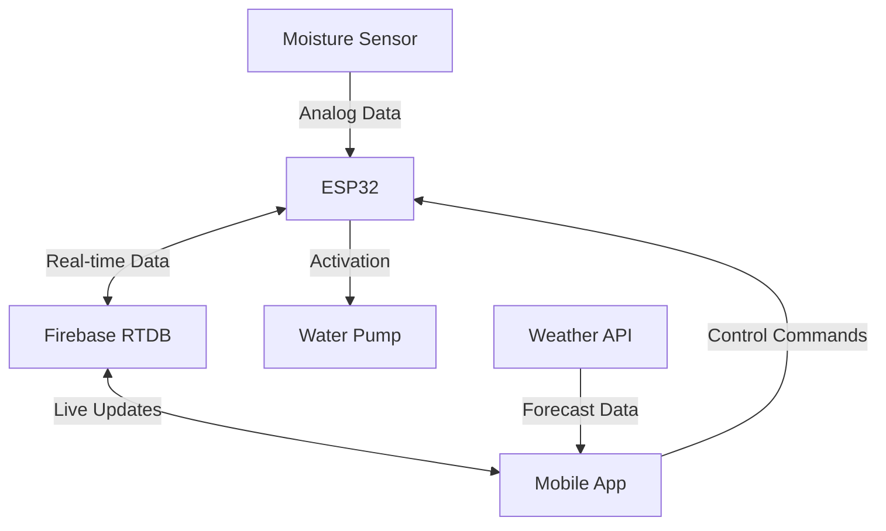

# 🌱 GreenLand – Smart Agriculture Mobile Application


---

## 🌟 Application Overview

<p align="center">
  
</p>

## ✨ Key Features

- 🌡️ Real-time soil moisture monitoring
- 💧 Smart automatic and manual irrigation control
- 📊 Dynamic data visualization with animated charts
- 🗺️ Interactive map integration with smooth animations
- 🔐 Secure authentication system with smooth transitions
- ⛅ Weather-based irrigation control with dynamic updates
- 📱 Cross-platform compatibility (iOS & Android)
<p align="center">
  
</p>


---

## 📱 Project Description

**GreenLand** is a smart agriculture solution that combines a React Native mobile application with an ESP32-based IoT system. The application features beautiful animations and transitions throughout the user interface for an engaging experience.

### 🎨 Animation Features

- **Fluid Transitions**: Smooth screen transitions using React Native Reanimated
- **Interactive Charts**: Animated data visualization for humidity and weather data
- **Dynamic Weather Widget**: Live weather updates with fluid animations
- **Loading States**: Beautiful loading animations and skeletons
- **Button Feedback**: Responsive touch feedback with spring animations
- **Map Interactions**: Smooth map zooming and marker animations
- **Pull-to-Refresh**: Custom animated refresh indicators
- **Modal Transitions**: Elegant modal presentation animations
- **Notification Banners**: Sliding notification animations

---

## 🧠 System Architecture



### 💫 Animation Architecture

The application uses a layered animation architecture:

```
[Reanimated Worklet Thread]
         ↑
    Native Drivers
         ↑
 [JavaScript Thread]
         ↑
  React Components
```

- Worklet-based animations for smooth 60 FPS performance
- Native driver enabled for optimal performance
- Shared values for cross-component animations
- Spring-based physics for natural motion

---

## 🔧 Technologies Used

### Frontend Technologies
| Technology | Purpose |
|------------|---------|
| React Native | Core mobile framework |
| React Native Reanimated 3 | High-performance animations |
| React Native Gesture Handler | Touch interactions |
| Victory Native | Animated charts |
| React Native Maps | Location services |
| React Native SVG | Vector graphics |

### Backend & IoT
| Technology | Purpose |
|------------|---------|
| ESP32 | IoT device control |
| Firebase RTDB | Real-time data sync |
| Firebase Auth | User authentication |
| Cloud Functions | Backend processing |
| Weather API | Forecast data |

---

## 📂 Project Structure

```
GreenLand/
├── assets/                # Static resources
│   ├── animations/       # Lottie animation files
│   ├── images/          # Image assets
│   └── fonts/           # Custom fonts
│
├── components/           # Reusable components
│   ├── AppHeader.js     # Main header component
│   ├── WeatherWidget.js # Weather display
│   ├── Charts/         # Chart components
│   │   ├── HumidityChart.js
│   │   └── AnimatedLineChart.js
│   ├── Map/           # Map components
│   │   ├── MapViewWidget.js
│   │   └── AnimatedMarkers.js
│   └── UI/            # UI components
│       ├── WaterButton.js
│       └── AnimatedSlider.js
│
├── screens/             # App screens
│   ├── LoginScreen.js
│   ├── RegisterScreen.js
│   └── HelpScreen.js
│
├── animations/          # Animation configurations
│   ├── transitions.js
│   └── shared.js
│
├── firebase/           # Firebase configuration
│   └── firebaseConfig.js
│
└── App.js             # Root component
```

---

## 🚀 Installation & Setup

### 📱 Mobile Application Setup

```bash
# Clone the repository
git clone https://github.com/yourusername/greenland.git

# Navigate to project directory
cd greenland

# Install dependencies
npm install

# Install specific animation dependencies
npm install react-native-reanimated react-native-gesture-handler

# Start the application
npm start
```

### 🔌 ESP32 Setup (Arduino IDE)

1. Required Libraries:
   - `WiFi.h`
   - `FirebaseESP32.h`
   - `ArduinoJson.h`

2. Hardware Configuration:
   ```cpp
   // See ESP32 code documentation
   ```

### ⚙️ Animation Setup

Add to `babel.config.js`:
```javascript
module.exports = {
  plugins: ['react-native-reanimated/plugin'],
};
```
  - `WebServer.h`
  - `ArduinoJson.h`
- Flasher le code sur ESP32
- Connecter les composants (capteur → GPIO32, pompe → GPIO33 via relais)

---

## 📲 Fonctionnalités de l’application

- 📉 Affichage du taux d’humidité
- 📍 Localisation du système
- ⚙️ Réglage du seuil d’arrosage
- 🌧 Détection de pluie à venir (simulation/API)
- 💦 Contrôle manuel ou automatique de la pompe
- 🔐 Authentification sécurisée avec Firebase

---

## 🧪 Testé sur

- ✅ Android 10+ (via Expo Go)
- ✅ ESP32 DevKit v1
- ✅ Capteur capacitif V1.2

---

## 👨‍💻 Auteurs
- 🧑‍💻 Mouradi Ayoub

---

